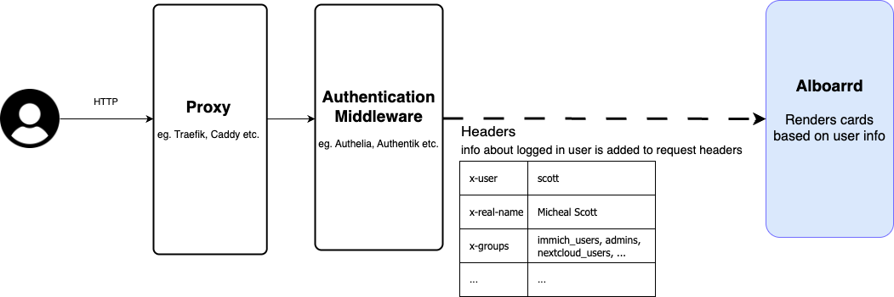

# Alboarrd

Alboarrd is a fast, lightweight service hub for your homelab, showing the user the services they can access.

## How does it work ?



Alboarrd is designed to run behind an authentication middleware (e.g. Authelia). The middleware injects information about the logged-in user into the request headers, which Alboarrd then reads.

Based on the user’s groups, Alboarrd renders a configurable set of clickable cards for the services they can access. Each card links to the corresponding service URL.

## Deploying Alboarrd

- **Docker compose**

```yaml
name: "alboarrd"

services:
  alboarrd:
    image: cerfedino/alboarrd:latest
    restart: unless-stopped
    volumes:
      - ./config.yaml:/etc/config.yaml:ro
    ports:
      - "3000"
```

### Configuration

1. **Config file**\
   `config.yml` specifies the cards that can be rendered

```yaml
cards:
  - name: Authelia
    url: https://auth.crfda.com
    icon: https://www.authelia.com/images/branding/logo-cropped.png

  - name: Immich
    url: https://immich.example.com
    icon: https://example.com/immich.png
    groups:
      - immich

  - name: Nextcloud
    url: https://nextcloud.example.com
    icon: https://example.com/immich.png
    groups:
      - nextcloud_users
      - nextcloud_admins
```

| attribute | description                                                                                         | required |
| --------- | --------------------------------------------------------------------------------------------------- | -------- |
| _name_    | header of the card                                                                                  | yes      |
| _url_     | URL to navigate to when the card is clicked                                                         | yes      |
| _icon_    | icon on the card                                                                                    | no       |
| _groups_  | Shows the card only if the user is part of any of these groups. If empty, the card is always shown. | no       |

## Why ?

I was looking for a dashboard application out there, but I didnt find anything that specifically suited my needs. Most of them are bloated with features I do not need, and almost none have the possibility of conditionally rendering items dynamically based on the user's info.\
I specifically needed a dashboard that would hide/show elements based on the user's group membership, so I decided to just do it myself.
